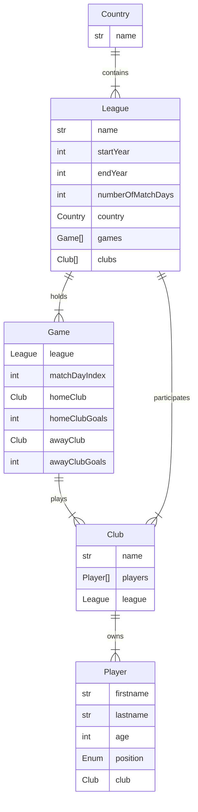

# Mermaid

## entity relationship diagram

```mermaid
erDiagram
  Country {
    str name
  }
  League {
    str name
    int startYear
    int endYear
    int numberOfMatchDays
    Country country
    Game[] games
    Club[] clubs
  }
  Game {
    League league
    int matchDayIndex
    Club homeClub
    int homeClubGoals
    Club awayClub
    int awayClubGoals
  }
  Club {
    str name
    Player[] players
    League league
  }
  Player {
    str firstname
    str lastname
    int age
    Enum position
    Club club
  }

  Country ||--|{ League : contains
  League ||--|{ Game : holds
  Game ||--|{ Club : plays
  Club ||--|{ Player : owns
  Club }|--|| League : participates
```
